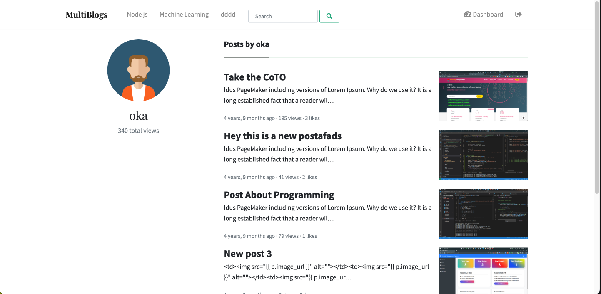
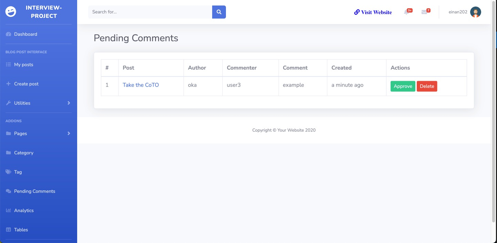
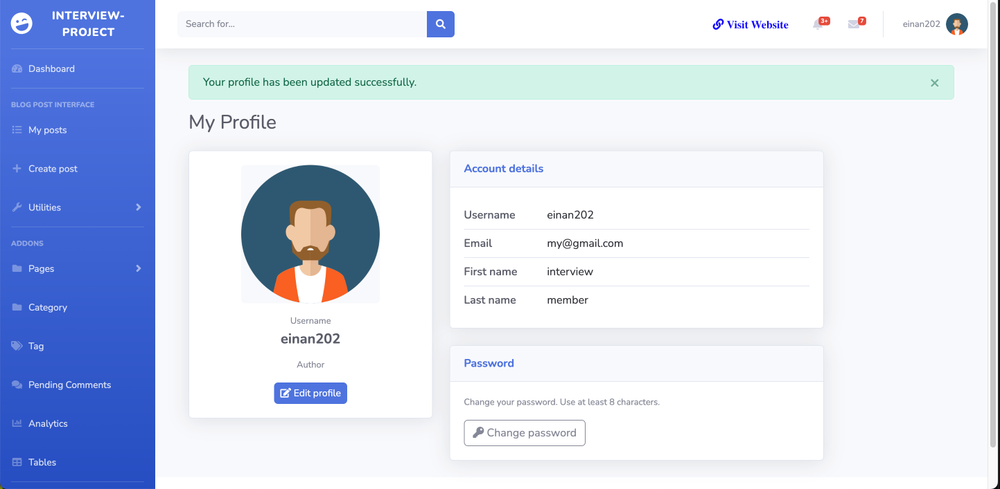
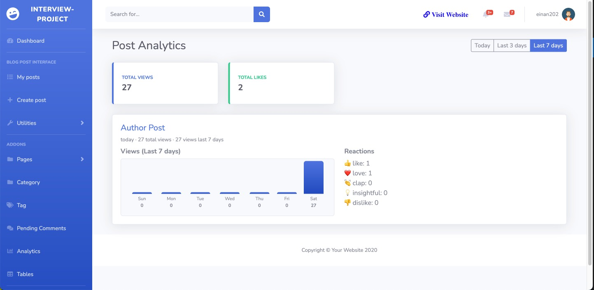
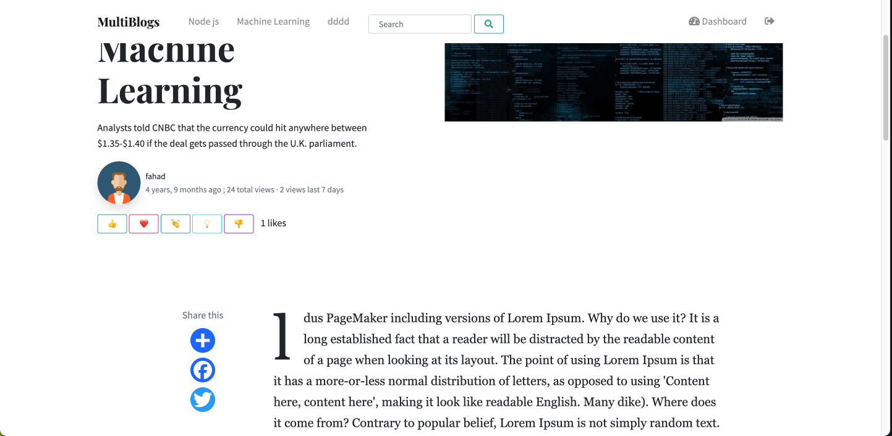

##  MultiBlogs - Multi Authors Blog Project in Django/Python
#### Navigation : [Technology](#technology-used---)--[Setup Local](#how-to-setup-in-windowsmaclinux)--[Project Features](#project-features---)--[Extended Features](#extended--interview-features)--[Project Images](#project-images)--[Issues](#issues--questions)--[Owner Info](#owner-info) 

  

### Technology Used : -
1. Python Web Framework Django as Backend
2. HTML, CSS & Framework BootsTrap  
3. JS

### Tempaletes Used : -
1. For Frontend, Mundana BootsTrap Blog Templates. 
2. For Frontend User Admin Panel, SB Admin 2 .

#### Download both templates from below : -
1. Frontend Templates [ Mundana Bootstrap Blog ](https://www.wowthemes.net/mundana-free-html-bootstrap-template/).
2. Frontend User Admin Panel [ SB Admin 2 ](https://startbootstrap.com/theme/sb-admin-2).

### How to SETup in Windows/MAC/Linux
1. Clone this Project <code>git clone https://github.com/einan202/YE-interview.git</code>
2. Go to Project Directory <code>YE-interview</code>
3. Create a Virtual Environment :-
    * for Linux/Mac <code>python3.10 -m venv venv </code>
4. Activate Virtual Environment <code>source venv/bin/activate </code>
5. Install Requirment Packages <code>pip install -r requirements.txt</code>
6. Migrate Database :-
    * For Linux/Mac <code>python3.10 manage.py migrate</code>
7. Create SuperUser :-
    * For Linux/Mac <code>python3.10 manage.py createsuperuser</code>
8. Finally Run the Projects :-
    * For Linux/Mac <code>python3.10 manage.py runserver</code>

### Project Features : -

1. Dedicated Users Frontend Admin Panel.
2. Frontend __Login/ Register__ System.
3. User`s Sides (Frontend) -
    * Users can register.
    * Users can login/logout.
    * Users can add Posts.
    * Users can Show / Hide Posts.
    * Users can edit posts.
    * Users can Delete Posts.
4. Admin`s Sides (Frontend) -
    * Admins can add posts.
    * Admins can add Categories.
    * Admin can edit posts.
    * Admin can edit categories.
    * Admin can delete Posts.
    * Admin can delete categories.
    * Admin can add users and delete users.
    * Admin can make posts Features.
    * Admin can Approve or Pending posts.
5. Blog Posts Features - 
    * Blog`s Menu shows categories with most posts under them. Highest to Lowest.
    * Posts are showing by Featured,by Recently added,by Categories, by most views count.
    * Only the Active/Approved ,not the pending post, will show.
    * Each Post has Visit Count.
    * Post can be featured or popular by most views counts and comments.
    * Each post has comment features.
6. Has __Subscription System__ to collect Emails for further email marketing.
7. Releted posts by users.
8. Search Facility.
9. Dedicated Single Category page by ( featured, popular, recently added).
10. Social Media Sharing System & Much More.

### Extended / Interview features

11. **Author profile (public)** – Public page per author with avatar, total views, and list of posts with view and like counts.
12. **View counting** – One view per user (or per session for anonymous) per post; author's own views are not counted. Daily views stored for charts.
13. **Post analytics (dashboard)** – Per-post views over Today / Last 3 days / Last 7 days and reaction breakdown (like, love, clap, insightful, dislike). Total views and total likes summary.
14. **Likes / reactions** – Logged-in authors can like/react to published posts (like, love, clap, insightful, dislike). Authors cannot like their own post.
15. **Draft → Pending → Active workflow** – Authors save as draft or submit for review; only staff can publish or return to draft. Posts list shows Views and Likes for active posts.
16. **Pending comments** – Table of unapproved comments with Approve and Delete; post author or staff can moderate.
17. **Change password** – Dashboard profile includes "Change password" (current password + new + confirm, min 8 characters).
18. **Category slugs** – Topic URLs use slug (e.g. `/topic/machine-learning/`). Slugs are ensured for nav and category pages.
19. **Edit permission** – Staff/superuser can edit any post; authors can edit their own.
20. **Single-post views chart** – On each post, "Views" with Today / Last 3 days / Last 7 days; chart does not trigger an extra view count when switching range.

Screenshots for the extended features above are in the **Project Images** section below.

### Project Images 

#### User Register page

#### Users Login Page

#### Category Page

#### Single Blog Post Page

#### Search Result Page

#### Extended features (screenshots)

##### 1. Post Analytics (dashboard)
Total views, total likes, and per-post charts (Today / Last 3 days / Last 7 days) with reaction breakdown (like, love, clap, insightful, dislike).

##### 2. Pending Comments
Moderate comments: view post, author, commenter, and comment text; Approve or Delete each.

##### 3. My Profile & Change password
Account details (username, email, first/last name) and Change password (current + new + confirm, min 8 characters).

##### 4. Public Author Profile
Author avatar, username, total views across their posts, and list of published posts with view and like counts.

##### 5. Single post – reactions and view count
Reaction buttons (like, love, clap, insightful, dislike) and total view count on the post page.

##### 6. Single post – views chart
Views chart with Today / Last 3 days / Last 7 days; switching range does not count an extra view.

")

### Issues & Questions
This project is scalable. Anyone can contribute here. Anyone can use it as it is Under __MIT License__ . 
If anyone wants to contribute to the project then first make an [Issues](https://github.com/yeazin/Multi-Authors-advanced-Django-Blog/issues) here. 
For further information anyone can knock me at __Email__ & __Facebook__ which is given in the [Owner Info](#owner-info).  
Thanks !!! 
### Owner Info 

__Md. Nazrul Islam Yeasin__  
__Email :__ [ naz.yeasin@gmail.com ](mailto:naz.yeasin@gmail.com)  
__Github :__ [yeazin](https://github.com/yeazin) 
__FaceBook :__ [Yea Sin](https://facebook.com/yeazin.io)  
__Linkedin :__ [Yea Sin](https://www.linkedin.com/in/yeazin/)
 
 

[Go To Top ↑ ](#multiblogs---multi-authors-blog-project-in-djangopython)  

